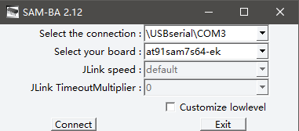
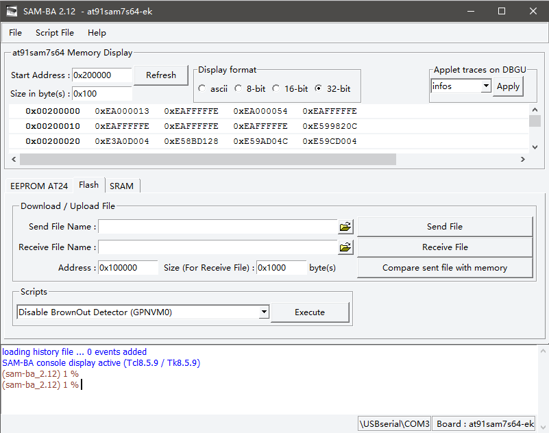
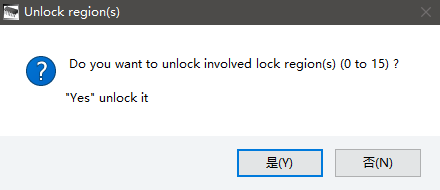
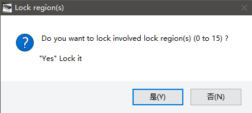
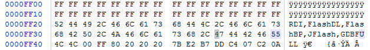

太久没有用到Jlink烧写程序，前天出现了固件被冲还有烧上新固件之后出现`The emulator is JLink-Clone, the segger software only support orginal segger device`的提示，之后IDE崩溃Keil被强制退出，这里参考一些博客找到了方法来解决这些问题。

## 固件被冲的解决方法

固件被冲的原因可能是使用不当导致的，具体现象是Jlink上的`USB`及`POWER`两个灯不亮和插上电脑后出现`无法识别的设备`的提示。

### 1st. 下载烧写软件及固件

- (此软件支持Win10 64位系统)[SAM-BA v2.12.exe](http://download.csdn.net/detail/hzt12345hf/9457629){:target="_blank"}。

- 修改之后的固件(具体修改内容可见下面)[JLink-v8.bin](http://download.csdn.net/detail/hzt12345hf/9457633){:target="_blank"}。

- Jlink驱动使用系统自动安装即可。

### 2nd. 擦除Jink上flash(AT91SAM7S64)中的程序(ERASE)

*注意，插针位置可能由于Jlink版本不同而不同。*

- 将固件被冲的Jlink通过USB连接上电脑供电；

- 使用跳线或者镊子将`ERS`与`3V3`插针短接并保持短接状态超过10s；

- 断开短接状态；

- 断开USB连接。

### 3rd. 将SAM-BA Boot固件复制到flash的前两个扇区(COPY) 

- 将`TST`与`3V3`插针短接。

- 将Jlink通过USB供电并保持10s以上。

- 断开USB连接；

- 断开短接状态。

### 4th. 烧录固件

- 擦除完成后将Jlink重新连接到电脑，会自动安装驱动，打开设备管理器(win10)，可以看到一个如同下图一样的串行设备；

  

  

- 打开烧录软件SAM-BA，并选中串口端口号以及板子型号(下图)之后点击`connect`；

  

  

- 在新弹出的界面中的`Download/Upload File`下选择下载的`Jlink-V8.bin`并点击`Send File`；

  

  

- 提示是否解锁寄存器，点击是；

  

  

- 传输完成后提示是否锁定寄存器，如果以后更新固件选择否，不更新就选择是；

  

  

- 断开USB并重新连接到电脑，就会自动安装Jlink驱动，打开Keil提示更新固件时，如果使用的是修改过的固件就可以放心的点击更新即可，本人测试Keil版本5.22可以更新成功并正常使用。

以上内容参考自: [win10 64位JLink v8固件丢失修复总结](http://blog.csdn.net/hzt12345hf/article/details/50846447){:target="_blank"}

## 提示clone的原因及解决方法

出现`The emulator is JLink-Clone, the segger software only support orginal segger device`错误的原因是你所使用的Jlink是盗版的，而SEGGER会对Jlink的S/N及其他一些内容进行验证，如果不是正版就会强制退出使用的IDE，这里找到了一个成功率100%的解决方法，文前提到的修改后的`Jlink-V8.bin`就是这个方法修改之后的产物。

使用WinHex对原先厂商提供的`V8.bin`进行修改，修改内容如下：

- 将偏移地址为`0xFF00`的4Bytes修改为0xFFFFFFFF或者其他值(该4Bytes为固件S/N，注意不能为0x11111117或者0x80530616)；

- 将偏移地址为`0xFF30`后面的`GDBFull`修改为`GDBFULL`(跳过GDBFull check)。

  

  

以上内容参考自: [J-LINK the connected emulator is a j-link clone问题](http://blog.sina.com.cn/s/blog_8a30d1990102vo66.html){:target="_blank"}