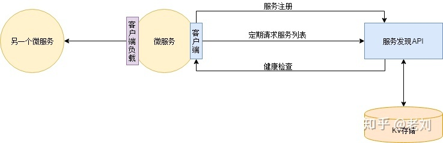
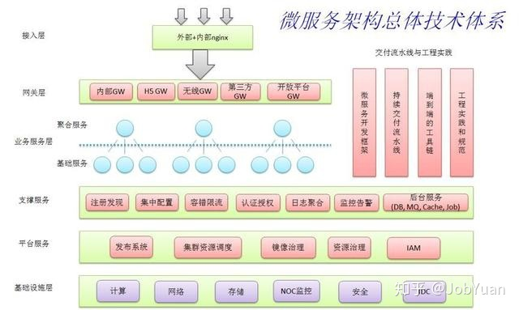

### 微服务

- **单体式应用程序**：与微服务相对的另一个概念是传统的单体式应用程序（Monolithic application）,单体式应用程序内部包含了所有需要的服务，而且每个服务功能没款有很强的耦合性，也就是相互依赖彼此，很难进行拆分和扩容。
  - 优点：开发简洁，容易部署，容易测试
  - 缺点：某个业务模块负载过高时不能单独扩展该服务，必须扩展整个应用程序；并且升级困难，开发曲线陡峭。

- 监控

- 链路跟踪：记录每个用户请求时，微服务内部产生了多少次的服务调用，及其调用关系。参考Google的Dapper。
  - 可以定位到哪个服务出现问题，不能提供具体的错误信息，需要日志分析组件来提供。

- 日志分析

- 网关：权限控制，服务治理，在调用者和被调用者之间，每次调用时进行权限校验

- 服务注册与发现：动态扩容
  - 注册一个服务发现服务，提供所有已经注册服务的地址信息的服务。（DNS也算是一种服务发现服务）
  - 各个应用服务在启动时自动将自己注册到服务发现服务上；
  - 应用服务启动后实时（定期）从服务发现服务同步各个应用服务的地址列表到本地；
  - 服务发现服务定期检查应用服务的健康状态，去掉不健康的实例地址
  - 这样在新增实例时只需要部署新实例，实例下线后直接关停服务即可，服务发现会自动检查服务实例的增减

    

  - 服务发现还会跟客户端负载均衡配合使用，由于应用服务已经同步服务地址列表在本地了，所以访问微服务时，可以自己决定负载策略。
  - 微服务发现注册的典型实现：ETCD(高可用、分布式、一致性、键值表，用于共享配置和服务发现)；ZK

    

#### 微服务架构的立方体式扩展

- X轴扩展：在多个实例之间实现请求的负载均衡
- Z轴扩展：根据请求的属性路由请求，不同于X轴扩展，Z轴扩展每个实例仅负责数据的一个子集
- Y轴扩展：根据功能把应用拆分为服务
- X轴和Z轴扩展可以有效提升应用的吞吐量和可用性，Y轴扩展可以把一个单体应用分成一组服务。

- **服务**本质上是一个麻雀虽小五脏俱全的应用程序，它实现了一组相关的功能，例如订单管理、客户管理等；服务可以在需要的时候借助X轴和Z轴方式进行扩展。例如订单服务可以被部署到一组负载均衡的服务实例上。

- **微服务架构**：把应用程序功能性分解为一组服务的架构风格。重要的是每一个服务都是一组专注的、内聚的功能职责组成。并且每个服务之间都是低耦合的。

- 每个服务都有自己的数据库，以此实现了每个服务之间的低耦合。

#### 微服务架构的利弊

- 优点：
  - 使大型的复杂应用程序可以持续交付和持续部署
  - 每个服务都相对较小并易于维护
  - 服务可以独立扩展
  - 更好的容错性
  - 更易于实验和采纳新技术

- 缺点：
  - 服务如何拆分和定义是一项挑战
  - 分布式系统带来的复杂性使开发、测试和部署变得困难
  - 当部署跨越多个服务的功能时需要谨慎的协调更多团队
  - 微服务架构并非银弹

### 服务的拆分策略

- **软件架构**：计算机系统的软件架构是构建这个系统所需要的一组结构，包括软件元素、它们之间的关系以及两者的属性。

### ETCD

