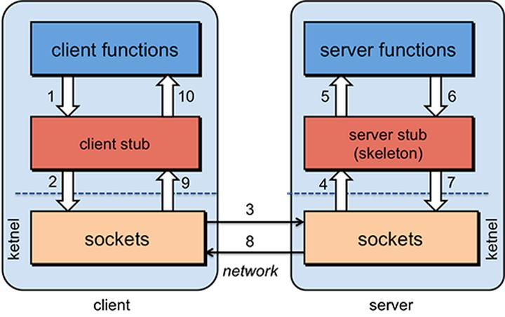

### RPC

- RPC(Remote Procedure Call)，即远程过程调用，可以理解为一个节点如何请求另一个节点所提供的服务。
  - 两台服务器A、B，一个应用部署在服务器A上，想要调用服务器B上应用提供的函数/方法，由于不在一个内存空间，不能直接调用，需要通过网络来表达调用的语义和传达调用的数据。
  - **Call ID映射**：在RPC中，所有的函数都必须有自己的一个ID，这个ID在所有 进程中都是唯一确定的，客户端在远程过程调用时，必须附上这个ID。
    - 这就需要在客户端和服务端分别维护一个`{函数->Call ID}`的映射表。
    - 两者的表不一定完全相同，但是相同的函数对应的Call ID必须相同。
    - 当客户端需要进行远程调用时，就找出相应的Call ID，然后传给服务端，服务端也需要查表，来确定客户端需要调用的函数，然后执行相应函数的代码。
  - **序列化和反序列化**：远程过程调用时，客户端和服务端时不同的进程，不能通过内存来直接传递参数，甚至有时候客户端和服务端使用的不是同一种语言。
    - 需要客户端将参数转换成一个字节流，传给服务端后，再把字节流转化为可以读取的格式。这个过程成为序列化和反序列化。
  - **网络传输**：远程过程调用往往使用在网络上，客户端和服务端是通过网络连接的。
    - 所有的数据都需要通过网络传输，因此就需要一个网络传输层。网络传输层需要把Call ID和序列化后的参数字节流传给服务端，然后再把序列化后的调用结果传回客户端。
    - 只要可以完成这两者的，都可以作为传输层使用，因此它所使用的协议其实是没有限制的，能够完成传输即可，大多数RPC框架使用TCP协议。

- RPC可以不依赖应用层协议，可以直接基于TCP进行远程调用，在传输层就可以完成通信，因此更适合某些对效率要求更高的场景。

- RPC调用方式依赖于客户端于服务端之间建立Socket连接来实现二进制数据通信，底层较为复杂，所以出现了一些RPC框架如Thrift,gRPC,Dubbo等

- RPC的具体过程如下：
```
//Client端
// int l_times_r = Call(ServerAddr, Multiply, lvalue, rvalue)
1,将这个调用映射为Call ID。
2,将Call ID,lvalue和rvalue序列化。可以直接将它们的值以二进制形式打包
3,把2中得到的数据包发送给服务端地址ServerAddr，需要使用到网络传输层
4,等待服务器返回结果
5,如果服务器调用成功，那么将结果反序列化，并赋值给l_times_r
--------------------------------------------------------------------
//Server端
1,在本地维护一个Call ID到函数指针的映射call_id_map
2,等待请求
3,得到一个请求后，将其数据包反序列化，得到Call ID和参数
4,通过在call_id_map中查找，得到函数指针
5,本地调用相应函数
6,将结果序列化后通过网络返回给Client端
```

<div class="image-wrapper" style="text-align: center">
  
</div>


### Thrift

- Thrift是一种跨语言的服务部署框架，Thrift通过IDL(Interface Definition Language,接口定义语言)来定义RPC的接口函数和数据类型
  - 然后通过thrift编译器生成不同语言的代码，并由生成的代码负责RPC协议层和传输层的实现。
  - 用户可以根据需求采用不同的语言开发客户端和服务端代码。

- Thrift提供跨语言的服务框架，用户只需要使用IDL对接口函数进行描述，之后就可以将该接口文件翻译为各种语言版本。

- Thrift开发流程：先定义IDL，使用thrift工具生成目标语言接口(interface)代码，然后进行开发

<div class="image-wrapper" style="text-align: center">
  
</div>

- 图中，TProtocol(协议层)定义数据传输格式，主要有：
  - `TBinaryProtocol`：二进制格式
  - `TCompactProtocol`：压缩格式
  - `TJSONProtocol`：JSON格式
  - `TSimpleJSONProtocol`：提供JSON只写协议，生成的文件很容易通过脚本语言解析
  - `TDebugProtocol`：使用易懂的可读的文本格式，以便于debug

#### Thirift IDL

- Thrift IDL支持的数据类型包含：

- **基本类型**：thrift不支持无符号类型，因为很多变成语言不存在无符号类型
  - `byte`：有符号字节
  - `i16`：16位有符号整数
  - `i32`：32位有符号整数
  - `i64`：64位有符号整数
  - `double`：64位浮点数
  - `string`：字符串

- **容器类型**：集合内的元素可以是除了service之外的任何类型，包括exception
  - `list<T>`：一系列由T类型的数据组成的有序列表，元素可以重复
  - `set<T>`：一系列由T类型的数据组成的无序组合，元素不可重复
  - `map<K,V>`：一个字典结构，key为K类型，value为V类型

- **结构体(struct)**：thrift支持struct类型，目的是将一些数据聚合在一起，方便传输惯例，struct的定义形式如下：
```
struct People{
    1:string name;
    2:i32 age;
    3:string sex;
}
```

- **枚举(enum)**：
```
enum Sex{
    MALE,FEMALE
}
```

- **异常(exception)**：thrift支持自定义exception，规则和struct一样
```
exception RequestException{
    1:i32 code;
    2:string reason;
}
```

- **服务(service)**：thrift中的服务相当于Go中interface，创建的service经过代码生成命令之后就会生成客户端和服务端的框架代码
  - 用来定义使用thrift的服务器的函数结构，一个服务可以扩展其他的服务，那么这个服务就可以提供被扩展服务的函数接口
```
service HelloWorldService{
    // service中定义的函数，相当于interface中定义的函数
    string doAction(1:string name, 2:i32 age);
}
```

- **类型定义**：thrift支持类似C++一样的typedef定义
```
// 末尾没有逗号或者分号
typedef i32 Integer
typedef i64 Long
```

- **常量(const)**：thrift支持常量定义，使用const关键字
```
// 末尾分号可选，支持16位进制赋值
const i32 MAX_RETRIES_TIME=10
const string MY_WEBSITE="http://baidu.com"
```

- **命名空间(namespace)**：thrift的命名空间相当于C++中的命名空间，主要目的是为了组织代码
```
// 格式：namespace 语言名 路径
// 末尾没有分号
namespace go com.elbow.thrift
```

- **文件包含**：thrift支持文件包含，相当于C++中的include
```
include "global.thrift"
```

- **注释**：thrift注释方式支持shell风格的注释，也支持C++风格的注释，即#和//开头的语句都当做注释，//*/*/也被当做注释

- **可选和必选**：thrift提供两个关键字required,optional，分别表示对应的字段是必填的还是可选的
```
struct People{
    // name是必填的
    1:required string name;
    // age是可选的
    2:optional i32 age;
}
```

- 参考[Golang beego从零开始基于thrift-0.12.0创建一个RPC服务](https://blog.csdn.net/chenthe1/article/details/100159323)
